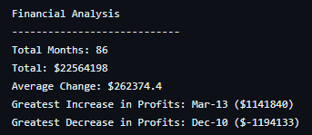
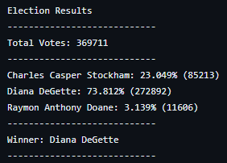

# python-challenge
This repository contains two python scripts for data analytics:
* PyBank analyzes financial records of a fictious company
* PyPoll focuses on helping a small, rural town modernize its vote-counting process

# Features
* PyBank uses python to analyze a csv formatted dataset with two columns ("Date" and "Profit/Losses") outputting the following:
  * The total number of months included in the dataset
  * The net total amount of "Profit/Losses" over the entire period
  * The changes in "Profit/Losses" over the entire period, and then the average of those changes
  * The greatest increase in profits (date and amount) over the entire period
  * The greatest decrease in profits (date and amount) over the entire period
* PyPoll uses python to analyze a csv formatted dataset of elevtion results with three colunms ("Voter ID", "County", and "Candidate") outputting the following:
  * The total number of votes cast
  * A complete list of candidates who received votes
  * The percentage of votes each candidate won
  * The total number of votes each candidate won
  * The winner of the election based on popular vote

# Results
PyBank: 

PyPoll: 

# File Notes
* PyBank folder contains all files associated with the PyBank instructions
   * main.py contains the python code that executes the instructions for PyBank
   * PyBank/Resources contains budget_data.csv (The main.py script relies on the Resources folder being at the same level)
   * PyBank/analysis was created as part of the setup to contain the results file rather than the script creating the folder
     * PyBank_results.txt is the file created/overwritten by the main.py script containing the results
* PyPoll folder contains all files associated with the PyPoll instructions
   * main.py contains the python code that executes the instructions for PyPoll
   * PyPoll/Resources contains election_data.csv (The main.py script relies on the Resources folder being at the same level)
   * PyPoll/analysis was created as part of the setup to contain the results file rather than the script creating the folder
     * PyPoll_results.txt is the file created/overwritten by the main.py script containing the results    

# References
The following references were used to identify various functions used within the script:
 * freecodecamp for writing to a text file: https://www.freecodecamp.org/news/file-handling-in-python/
 

# Getting Started

## Prerequisites
You must have a system environment with Python 3.10 or compatible. 

## Cloning Repo
$ git clone https://github.com/vt-bekah/python-challenge.git

## Running the scripts
$ cd python-challenge/PyBank  

$ python main.py

$ cd .. 

$ cd PyPoll  

$ python main.py

# Built With
* Python v3.10.11
* conda v23.5.0

**Python Modules**
* os 
* csv
